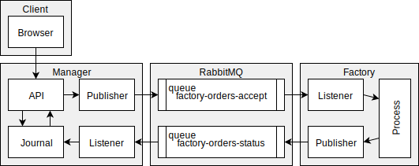

# Mine

This repository tries to satisfy requirements described in [Carbon based life forms](https://github.com/heficed/Carbon-Based-Life-Forms/blob/821ed4bbd7216a8622d6612cad5f50a249ad4f0f/README.md).

* Client is browser. In examples `curl` with `jq` will be used.
* Manager application can be found in `cmd/manager`.
* Factory application can be found in `cmd/manager`.

## Known issues

* No rabbit reconnetion logic.